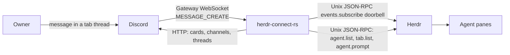

# herdr-connect-rs

Two-way Rust bridge between one Discord guild and agents in local Herdr panes.

## Architecture

Discord and Herdr do not share a socket. This process sits between them.



- **Herdr → Discord:** a Herdr subscribe event wakes the bridge. It then lists agents and tabs and diffs snapshots. A card posts only on `working` → `blocked`, `done`, or `idle`. The first snapshot after start is silent. Content comes from the vendor session Herdr reported, not from scraping the pane.
- **Discord → Herdr:** gateway events. An owner message in a thread named `… [tab_id]` under topic `herdr workspace [workspace_id]` becomes `agent.prompt` when exactly one matching pane is `idle` or `done`. Other surfaces stay silent.
- **Permissions (optional):** `herdr-connect-rs hook` speaks to a second Unix socket, `HERDR_CLAUDE_BROKER_SOCKET`. That path is not on by default; install [examples/cursor-hooks.json](examples/cursor-hooks.json) (or the Claude/Codex equivalent) if you want Allow/Deny cards.

Identity is the topic and the `[tab_id]` suffix. Existing names are not renamed.

## Configuration

`.env` (mode `600`, gitignored):

- `DISCORD_TOKEN`
- `DISCORD_GUILD_ID`
- `DISCORD_OWNER_ID`

`HERDR_SOCKET_PATH` if the Herdr socket is not the default. Never print or commit `.env`. Run only one bridge against a guild.

```bash
set -a; . ./.env >/dev/null 2>&1; set +a; cargo run
```

## Docs

- [AGENTS.md](AGENTS.md) — how to work in this repo
- [CONTEXT.md](CONTEXT.md) — terms
- [ROADMAP.md](ROADMAP.md) — remaining work
