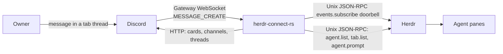

# herdr-connect-rs

Two-way Rust bridge between one Discord guild and agents in local Herdr panes.

## Architecture

Discord and Herdr do not share a socket. This process sits between them.



- **Herdr → Discord:** at startup, once Discord is configured, the bridge lists agents and tabs once and, in a spawned task beside the event loop, syncs every workspace channel and tab thread, then deletes every workspace channel and tab thread Herdr no longer lists. After that, a Herdr subscribe event wakes the bridge. It then lists agents and tabs and diffs snapshots. A card posts only on `working` → `blocked`, `done`, or `idle`. A pane whose Herdr integration reports no session identity is not mirrored: no tab thread and no card of any kind is created or posted for it, until a later snapshot reports one (its workspace channel is per workspace and may still exist because another pane in it has a session). A tab with a numeric label and no terminal title yet is skipped quietly and recorded as pending on every snapshot pass, whether or not its status changed; a session-wide `pane.updated` event naming that tab with a fresh title, or any other status transition, wakes the next pass to create its thread, while a name that can never be produced (for example, a tab id too long for Discord) is logged once rather than on every snapshot. A session pane whose captured reply text equals its last posted card is not reposted. While a session-carrying pane with a resolved tab thread is `working`, each new complete assistant text its vendor log records is followed live via `notify` and posted as its own plain message (never a tool call), with one final read on settle before the card so nothing is lost and the card skipped if it would repeat the last live text. A watch always starts at the turn's start, so a bridge restart mid-turn reposts text an earlier instance already posted for that turn; each message's nonce is derived from its log position, not from when the process started, so Discord's own nonce enforcement suppresses an exact repeat. The first snapshot after start is silent. Content comes from the vendor session Herdr reported, not from scraping the pane, except that a Claude pane's blocked card reads the pane's Herdr detection snapshot for the pending question when one is visible. A closed Herdr tab deletes its Discord thread; a closed Herdr workspace deletes its Discord channel.
- **Terminal prompts → Discord:** the owner's display name and avatar are fetched once at startup from `GET /users/{DISCORD_OWNER_ID}`. For every session-carrying pane with a resolved tab thread, following its vendor log for new user prompts starts the moment the bridge first sees the pane, using the same `notify` watch that drives live text: each new prompt is posted once into the tab thread, in log order, before any assistant text it produced, through a bridge-owned webhook (`herdr-connect owner`, one per workspace channel, found by name or created) executed with the owner's identity and `thread_id`. A prompt already in the log at that first sight is never replayed. A prompt the bridge itself just submitted from Discord is recognized once and dropped rather than mirrored back into the thread it came from. No thread or no session: dropped silently; a delivery error against an unknown channel clears the cached route and webhook, resolves both fresh, and retries once.
- **Discord → Herdr:** gateway events. An owner message in a thread named `… [tab_id]` under topic `herdr workspace [workspace_id]` becomes `agent.prompt` when exactly one matching pane is `idle` or `done`. Other surfaces stay silent.
- **Permissions (optional):** `herdr-connect-rs hook` speaks to a second Unix socket, `HERDR_CLAUDE_BROKER_SOCKET`. That path is not on by default; install [examples/cursor-hooks.json](examples/cursor-hooks.json) (or the Claude/Codex equivalent) if you want Allow/Deny cards.
- **Activity (optional):** `herdr-connect-rs activity --vendor claude`, `--vendor codex`, and `--vendor cursor` speak to the same `HERDR_CLAUDE_BROKER_SOCKET`; install [examples/claude-hooks.json](examples/claude-hooks.json) for Claude, [examples/codex-hooks.json](examples/codex-hooks.json) for Codex, or [examples/cursor-hooks.json](examples/cursor-hooks.json) for Cursor to enable the matching vendor. Each tool call it reports is folded into one plain message per pane per turn -- the first call posts it, later calls in the same turn edit it in place -- and the message is forgotten once the turn's transition card is delivered, so the next turn starts a new one. A pane whose tab has no thread yet drops the frame silently, and so does a pane the latest Herdr snapshot does not report as `working` with a session: the same no-session rule every other card follows.

Identity is the topic and the `[tab_id]` suffix. Existing names are not renamed.

## Configuration

`.env` (mode `600`, gitignored):

- `DISCORD_TOKEN`
- `DISCORD_GUILD_ID`
- `DISCORD_OWNER_ID`

`HERDR_SOCKET_PATH` if the Herdr socket is not the default. Never print or commit `.env`. Run only one bridge against a guild.

```bash
set -a; . ./.env >/dev/null 2>&1; set +a; cargo run
```

## Docs

- [AGENTS.md](AGENTS.md) — how to work in this repo
- [CONTEXT.md](CONTEXT.md) — terms
- [ROADMAP.md](ROADMAP.md) — remaining work
