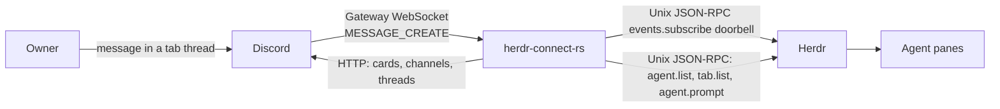

# herdr-connect-rs

Two-way Rust bridge between one Discord guild and agents in local Herdr panes.

## Architecture

Discord and Herdr do not share a socket. This process sits between them.



- **Herdr → Discord:** at startup, once Discord is configured, the bridge lists agents and tabs once and, in a spawned task beside the event loop, syncs every workspace channel and tab thread, then deletes every workspace channel and tab thread Herdr no longer lists. After that, a Herdr subscribe event wakes the bridge. It then lists agents and tabs and diffs snapshots. A card posts only on `working` → `blocked`, `done`, or `idle`. A pane whose Herdr integration reports no session identity is not mirrored: no tab thread and no card of any kind is created or posted for it, until a later snapshot reports one (its workspace channel is per workspace and may still exist because another pane in it has a session). A tab with a numeric label and no terminal title yet is skipped quietly and recorded as pending on every snapshot pass, whether or not its status changed; a session-wide `pane.updated` event naming that tab with a fresh title, or any other status transition, wakes the next pass to create its thread, while a name that can never be produced (for example, a tab id too long for Discord) is logged once rather than on every snapshot. A session pane whose captured reply text equals its last posted card is not reposted. The first snapshot after start is silent. Content comes from the vendor session Herdr reported, not from scraping the pane, except that a Claude pane's blocked card reads the pane's Herdr detection snapshot for the pending question when one is visible. A closed Herdr tab deletes its Discord thread; a closed Herdr workspace deletes its Discord channel.
- **Discord → Herdr:** gateway events. An owner message in a thread named `… [tab_id]` under topic `herdr workspace [workspace_id]` becomes `agent.prompt` when exactly one matching pane is `idle` or `done`. Other surfaces stay silent.
- **Permissions (optional):** `herdr-connect-rs hook` speaks to a second Unix socket, `HERDR_CLAUDE_BROKER_SOCKET`. That path is not on by default; install [examples/cursor-hooks.json](examples/cursor-hooks.json) (or the Claude/Codex equivalent) if you want Allow/Deny cards.

Identity is the topic and the `[tab_id]` suffix. Existing names are not renamed.

## Configuration

`.env` (mode `600`, gitignored):

- `DISCORD_TOKEN`
- `DISCORD_GUILD_ID`
- `DISCORD_OWNER_ID`

`HERDR_SOCKET_PATH` if the Herdr socket is not the default. Never print or commit `.env`. Run only one bridge against a guild.

```bash
set -a; . ./.env >/dev/null 2>&1; set +a; cargo run
```

## Docs

- [AGENTS.md](AGENTS.md) — how to work in this repo
- [CONTEXT.md](CONTEXT.md) — terms
- [ROADMAP.md](ROADMAP.md) — remaining work
