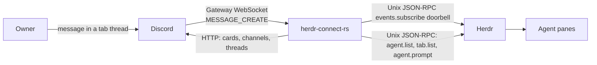

# herdr-connect-rs

Two-way Rust bridge between one Discord guild and agents in local Herdr panes.

## Architecture

Discord and Herdr do not share a socket. This process sits between them.



- **Herdr → Discord:** at startup, once Discord is configured, the bridge lists agents and tabs once and, in a spawned task beside the event loop, syncs every workspace channel and tab thread, then deletes every workspace channel and tab thread Herdr no longer lists. After that, a Herdr subscribe event wakes the bridge; it lists agents and tabs and diffs snapshots. The mirror is four rules, one watcher per pane:

  1. **A session-carrying pane appears:** create its tab thread and open one watcher on its vendor log at the current end -- or at position 0 if the log does not exist on disk yet, so the whole log it later writes is posted. A Codex pane reports its session only when its first prompt is submitted, so a session whose log was created after the bridge first saw the pane without one is also followed from position 0, and the first prompt and its reply are mirrored. For a Codex session with several rollout files, follow the file with the newest filename timestamp; continuation files belong to the same session, and older files are not merged. A pane whose Herdr integration reports no session identity is not mirrored: no tab thread and no card of any kind, until a later snapshot reports one (its workspace channel is per workspace and may still exist because another pane in it has a session). A session-carrying tab whose label is still Herdr's auto-assigned number is renamed, through the bounded `tab.rename` socket request, to a readable `word-word-word` name derived from its tab id, and its thread is named from that label like any owner-given label; owner-given labels are never touched, and a tab already carrying a generated name is not renamed again. The bridge does not follow `tab.renamed`: thread names are frozen once created. A tab whose rename fails keeps its numeric label, is not mirrored, and is retried on every pass; its error is logged once per tab until a rename succeeds. The first snapshot after start is silent.
  2. **The log gains a complete assistant text:** post it as its own plain message (never a tool call), in log order. This is per log position, and status plays no part -- a text written while the pane is `working`, `done`, or `idle` is posted the same way. A bridge restart re-follows from the current end, so it reposts nothing; separately, each message's nonce is derived from its log position, so if the same position were ever posted twice within Discord's nonce window it would be suppressed as an exact repeat. Content comes from the vendor session Herdr reported, not from scraping the pane.
  3. **The pane goes `blocked`:** post the blocked, permission, or question card. `working` and `done` post nothing -- a settled turn's reply, and a failed turn's error, both reach Discord as the pane's own live text under rule 2, not as a turn-end card. The blocked card is built once from whatever is available at that moment: a Claude pane's Herdr detection snapshot for the pending question, or the vendor log otherwise.
  4. **The pane closes, or its session resolves to a different log:** close the watcher. A closed Herdr tab deletes its Discord thread; a closed Herdr workspace deletes its Discord channel (Discord removes its threads with it). Whenever a tab thread is deleted, by the bridge or by the owner, the "started a thread" system message Discord posted for it in the workspace channel is deleted too, found among the messages around the thread's id by its reference to the thread. Deletion is two-way: when the owner deletes a tab thread in Discord, the bridge runs `herdr tab close` for the tab named in the thread's `[tab_id]` suffix, and when the owner deletes a workspace channel it runs `herdr workspace close` for the workspace in the channel's topic. The tab is resolved from a durable registry of bridge-owned thread ids that cache invalidation and refetches never clear (filled from every fetch, create, and archived listing), so a thread that auto-archived or left the cache is still resolved; a deleted thread the registry does not hold is not a live tab's thread and is ignored, with no Herdr call and no notice. Every workspace channel's archived threads are registered at startup in a task independent of the Herdr snapshot and the delete pass, so the thread of a sessionless tab that auto-archived is still resolved; a listing that fails is logged as an error. The close goes through Herdr's bounded RPC socket while holding the topology cache lock, so a delivery or sync that takes the lock afterwards finds the tab gone; a delivery that raced ahead of the gateway event can create one replacement thread first, and the close then ends the tab and the bridge's tab-closed handling deletes that replacement. The bridge ignores, once, the delete event of any thread or channel it deleted itself. That is the only time a watcher closes.
- **Terminal prompts → Discord:** the owner's display name and avatar are fetched once at startup from `GET /users/{DISCORD_OWNER_ID}`. For every session-carrying pane with a resolved tab thread, following its vendor log for new user prompts starts the moment the bridge first sees the pane, using the same `notify` watch that drives live text: each new prompt is posted once into the tab thread, in log order, before any assistant text it produced, through a bridge-owned webhook (`herdr-connect owner`, one per workspace channel, found by name or created) executed with the owner's identity and `thread_id`. A prompt already in the log at that first sight is never replayed. A prompt the bridge itself just submitted from Discord is recognized once and dropped rather than mirrored back into the thread it came from. No thread or no session: dropped silently; a delivery error against an unknown channel or unknown webhook clears the cached route or webhook and logs, and the next mirrored prompt resolves both again through the cache-first path -- there is no in-call retry.
- **Discord → Herdr:** gateway events. An owner message in a thread named `… [tab_id]` under topic `herdr workspace [workspace_id]` becomes `agent.prompt` when exactly one matching pane is `idle` or `done`. Other surfaces stay silent.
- **Permissions (optional):** `herdr-connect-rs hook` speaks to a second Unix socket, `HERDR_CLAUDE_BROKER_SOCKET`. That path is not on by default; install [examples/cursor-hooks.json](examples/cursor-hooks.json) (or the Claude/Codex equivalent) if you want Allow/Deny cards.
- **Activity (optional):** `herdr-connect-rs activity --vendor claude`, `--vendor codex`, and `--vendor cursor` speak to the same `HERDR_CLAUDE_BROKER_SOCKET`; install [examples/claude-hooks.json](examples/claude-hooks.json) for Claude, [examples/codex-hooks.json](examples/codex-hooks.json) for Codex, or [examples/cursor-hooks.json](examples/cursor-hooks.json) for Cursor to enable the matching vendor. Each tool call it reports is folded into one plain message per pane per turn -- the first call posts it, later calls in the same turn edit it in place -- and the message is forgotten when the pane next reports `working`, so the new turn starts a new one. A pane whose tab has no thread yet drops the frame silently, and so does a pane the latest Herdr snapshot does not report as `working` with a session: the same no-session rule the mirror follows.
- **Questions (optional, Claude only):** the same `herdr-connect-rs hook --vendor claude` also answers a Claude `AskUserQuestion` tool call matched by the `PreToolUse` entry in [examples/claude-hooks.json](examples/claude-hooks.json), so the owner answers from Discord instead of the pane blocking on Claude's own TUI dialog. Each question in the call gets its own card, in order, with a "Type an answer" hint either way: a single-select question gets one button per option, a multiSelect question gets a Discord select menu instead, and replying in the pane's own thread while any card is open -- single-select or multiSelect -- resolves it with the reply's text instead of submitting the reply as a prompt. Every question in the call must resolve before the hook answers -- the whole call shares one 30-second deadline, kept short because Claude cannot show its own terminal dialog while a card waits, and the first card to hit it falls the whole call through to Claude's own dialog, that card reading `expired: no owner answer`. A resolved card reads `resolved: <answer>`, a multiSelect answer joined with `, `.

Identity is the topic and the `[tab_id]` suffix. Existing names are not renamed.

## Configuration

`.env` (mode `600`, gitignored):

- `DISCORD_TOKEN`
- `DISCORD_GUILD_ID`
- `DISCORD_OWNER_ID`

`HERDR_SOCKET_PATH` if the Herdr socket is not the default. Never print or commit `.env`. Run only one bridge against a guild.

```bash
set -a; . ./.env >/dev/null 2>&1; set +a; cargo run
```

## Codex panes

Start Codex panes with `codex --no-daemon`. Without it, Codex runs one shared background server per `CODEX_HOME` that executes hooks with the environment of the pane that started it, so sessions and activity from every Codex pane are attributed to that one pane.

## Docs

- [AGENTS.md](AGENTS.md) — how to work in this repo
- [CONTEXT.md](CONTEXT.md) — terms
- [ROADMAP.md](ROADMAP.md) — remaining work
